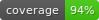
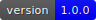
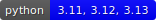
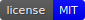

bumpwright documentation
========================

|coverage| |version| |python| |license|

Introduction
------------

Bumpwright is an automated semantic versioning tool that scans your code changes—not just commit messages—to suggest the right next version. In a single command, it compares your latest code against the last release and tells you whether to bump the version by a patch, minor, or major, taking the guesswork out of releases for maintainers of libraries and services with stable interfaces.

Overview
--------

What & Why
~~~~~~~~~~

Traditional release tools rely on commit messages, which can be inconsistent. Bumpwright inspects the public API directly to decide the next version, so breaking changes are caught even when commit messages miss them. It can also update version strings and generate changelog entries automatically, streamlining the release process.

How It Works
~~~~~~~~~~~~

Bumpwright compares two Git references—typically the last release tag and the current commit—and detects changes in your code’s public interface. Removed functions or changed signatures trigger a major bump, new features result in a minor bump, and bug fixes or small tweaks lead to a patch bump. Static analysis and optional analysers (for CLI commands, web routes, migrations, and more) inform these decisions. You can then apply the suggestion, update files, and optionally render changelog notes.

Key Benefits
~~~~~~~~~~~~

- **Simplicity** – run a single command to see how your API changed.
- **Accuracy** – catches breaking changes that commit messages may miss.
- **Flexibility** – configurable analysers and settings to fit your workflow.
- **Automation** – update version files and generate changelog entries.

Trade-offs / Constraints
~~~~~~~~~~~~~~~~~~~~~~~~

- **Baseline required** – needs a baseline reference (e.g., prior release tag); run ``bumpwright init`` to mark it.
- **Static analysis limits** – cannot account for runtime-specific changes or internal logic.
- **Python 3.11+** – focuses on Python projects and requires Python 3.11 or newer.

To get started immediately, try the following commands:

.. code-block:: bash

   bumpwright init
   bumpwright decide

New to Bumpwright? Start with the :doc:`get-started`.

.. grid:: 1 2 2 2
   :gutter: 2

   .. card:: New to Bumpwright?
      :link: get-started
      :link-type: doc

   .. card:: Need configuration details?
      :link: concepts/configuration
      :link-type: doc

   .. card:: Looking for recipes?
      :link: guides/index
      :link-type: doc

   .. card:: CLI reference
      :link: cli_reference
      :link-type: doc

Release workflow at a glance
----------------------------

.. list-table::
   :header-rows: 1

   * - Task
     - Purpose
   * - :doc:`init <usage/init>`
     - Record the current state as a baseline.
   * - :doc:`decide <usage/decide>`
     - Analyse changes and suggest the bump level.
   * - :doc:`bump <usage/bump>`
     - Apply the version change and update files.
   * - :doc:`history <usage/history>`
     - Review previous bump decisions.

.. toctree::
   :maxdepth: 1
   :caption: Get Started

   get-started

.. toctree::
   :maxdepth: 1
   :caption: Usage

   usage/init
   usage/decide
   usage/bump
   usage/history

.. toctree::
   :maxdepth: 1
   :caption: Versioning

   concepts/versioning

.. toctree::
   :maxdepth: 1
   :caption: Configuration

   concepts/configuration

.. toctree::
   :maxdepth: 2
   :caption: Guides

   guides/index
   troubleshooting

.. toctree::
   :maxdepth: 1
   :caption: CI/CD

   ci/github-actions

.. toctree::
   :maxdepth: 1
   :caption: CLI Reference

   cli_reference

.. toctree::
   :maxdepth: 1
   :caption: Changelog

   changelog/index

.. toctree::
   :maxdepth: 1
   :caption: Analysers

   analysers/index

.. toctree::
   :maxdepth: 1
   :caption: Project

   glossary
   contributing
   roadmap

